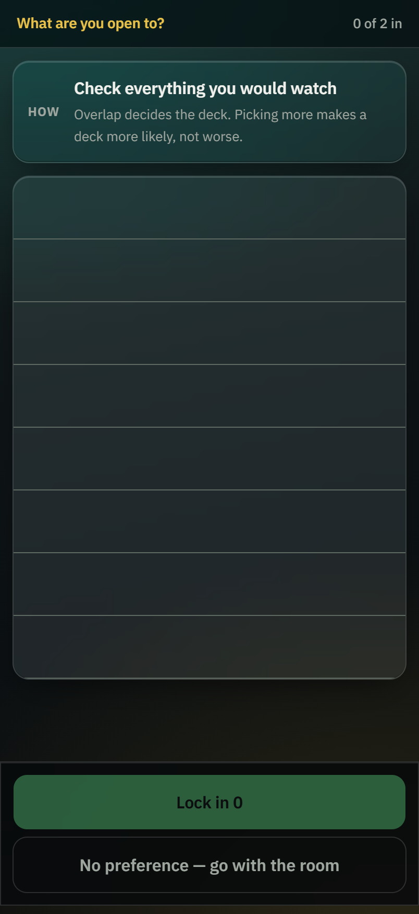
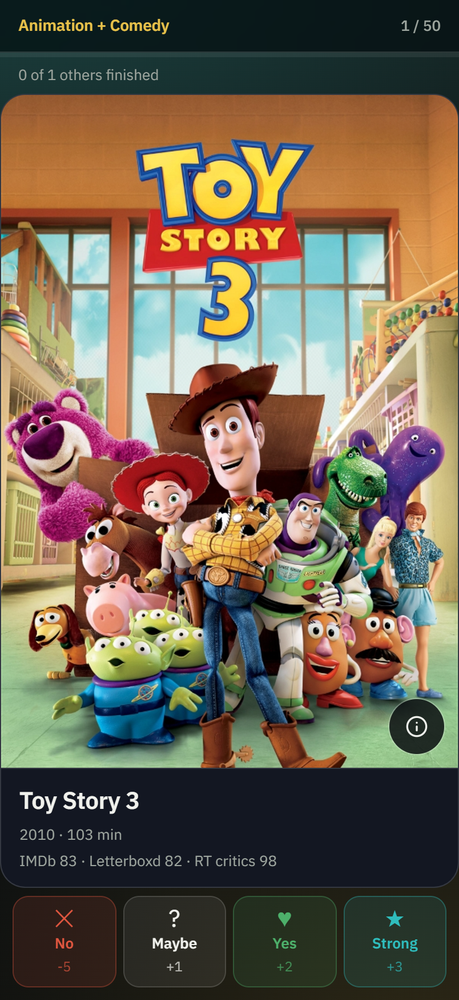
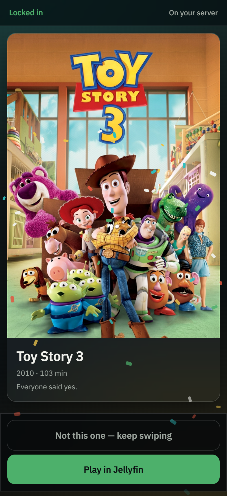

# Jellyfin Matcher

[](https://github.com/phineasfritsch/jellyfin-matcher/actions/workflows/docker.yml)
[](https://github.com/phineasfritsch/jellyfin-matcher/pkgs/container/jellyfin-matcher)
[](LICENSE)
[](CONTRIBUTING.md#the-one-command)
[](CONTRIBUTING.md#pinned-claims-and-why-a-test-might-fail-for-a-good-reason)

**Everyone swipes the same deck on their own phone. The first film you all like wins.**
No stalemates — that's the whole point.

A little self-hosted web app that ends the "I don't know, what do you want to watch?"
spiral. Knock out genres until two survive, then everyone swipes the same deck at the
same time. The moment everybody likes the same film it locks in, confetti and all. Get
through the whole deck without agreeing and the points decide, so you still get a winner.

<p align="center">
  
  
  
</p>

<p align="center">
  <em>Pick what you are open to, swipe the deck it builds, and the room lands on one film.
  Real films from a real library — <code>npm run shots</code> regenerates these against
  yours.</em>
</p>

It talks to a Jellyfin server for your local library, Jellyseerr for the "any movie" mode
(winners you don't own get requested, behind a confirmation), and MDBList for ratings.

## Why you might want it

- **It always ends.** Unanimous like locks it in; otherwise points decide. Somebody's
  phone dying mid-deck doesn't hang the room.
- **Guests don't need an account.** Scan the QR, type a name, swipe. Sign-in is only
  asked for when an action actually costs something.
- **Nothing downloads by accident.** "Any Movie" says so on the control, the card says
  which films aren't on your server, and the request itself takes a second tap.
- **It works in the dark, one-handed.** Every control is a 60px row, every vote has a
  button as well as a gesture, and the type scales with your OS text size.
- **One small container.** Multi-stage image, non-root, healthcheck, no database.

This project was a collaboration between me and Claude (Anthropic's coding agent). I
steered, made the calls on how the app should behave, and tested it on real hardware;
Claude wrote most of the code and did the API spelunking. Blame for weird decisions is
shared.

## How a session works

1. **Lobby.** Someone creates a room and gets a 4 letter code (no confusing characters like O/0). Others join by typing the code or scanning the QR. You pick the scope here:
   - **Jellyfin Only** builds the deck from what's on the server right now, so the winner plays tonight.
   - **Any Movie** pulls from TMDb (via Jellyseerr's discover endpoint). If the winner isn't in your library there's a button to request it, which lands in Radarr.
   
   There's also a max runtime slider and a deck size setting. Everybody hits ready and it starts.

2. **Genre knockout.** Everyone checks off the genres they'd be okay with tonight. If exactly two genres overlap, done. More than two, you vote genres out one round at a time until two are left. Less than two, the picks get pooled and eliminated the same way. If people pick almost nothing it just makes you vote again.

3. **The deck.** Movies tagged with *both* surviving genres go first (these are usually the good picks), sorted by rating. Behind those, single genre movies alternate one from each side. Ratings come from MDBList, which conveniently pre-normalizes everything to 0-100. The composite score is:

   ```
   score = 0.35 * letterboxd + 0.35 * imdb + 0.30 * rotten_tomatoes
   ```

   If a source is missing the weights redistribute across the ones that exist, so an unrated-on-letterboxd movie doesn't get buried. The 35/35/30 split is not science, it just felt right. Argue with us about it in an issue.

4. **Swiping.** Left is no (-5 points), up is maybe (+1), right is like (+2), and there's a super like button (+3). Buttons exist for every action too, you don't have to use gestures. Tap a poster (or the info button) to pull up the synopsis, an embedded trailer, and every rating MDBList knows about, not just the three that feed the score. The instant *every* person in the room has swiped right or super liked the same movie, the room locks and you're done. A "maybe" never triggers a match, that felt wrong.

5. **Fallback.** Deck runs out with no unanimous like? Every card gets `composite score + sum of everyone's points` and the highest total wins. Ties go to the both-genres tier.

Rooms support more than two people. Match just requires everyone, and the fallback sums all votes.

## Login

Sign-in is tied to what an action actually costs, not to the app as a whole, so account-less friends can still play. By default (`MATCHER_AUTH=requests`) a Jellyfin-only night needs no login at all: anyone can open a room, share the code, and swipe through what's on the server. Signing in with a Jellyfin account is only asked for when someone switches a room to "Any Movie" (which enables downloads) or fires an actual Jellyseerr request. Login goes through Jellyfin's own authenticate endpoint, so only real server accounts pass, and the admin API key stays server side and never reaches the browser. Sessions last 12 hours.

If you want it stricter, `MATCHER_AUTH=create` makes creating any room require an account (joining stays open), `all` requires an account to join too, and `off` turns login off everywhere. One thing to know about the default: since a Jellyfin-only room is openable by anyone who can reach the app, a guest in that room sees the deck of your library titles. That's the nature of the app, but if it matters, put a Cloudflare Access policy on the hostname or bump to `create`.

## Running it

You need Node 22+ (or just Docker), a Jellyfin server, and API keys. Jellyseerr is optional if you only ever use Jellyfin Only mode, but the genre list for Any Movie mode comes from it.

Five variables total, get them from: Jellyfin dashboard -> API keys, Jellyseerr settings -> general, and mdblist.com (free, the free tier is plenty). Where you put them depends on how you run it: Docker users set them right in `docker-compose.yml`, bare-metal installs copy `.env.example` to `.env` and fill that in.

### Straight on the server (no Docker)

```bash
git clone https://github.com/phineasfritsch/jellyfin-matcher.git && cd jellyfin-matcher
npm install
npm run build
npm start
```

That's it, one Node process on port 3000 (set `PORT` in `.env` to change it). Production mode is the default so `npm start` just works. If you want it to survive reboots, a systemd unit like this does the job:

```ini
[Unit]
Description=Jellyfin Matcher
After=network.target

[Service]
WorkingDirectory=/opt/jellyfin-matcher
ExecStart=/usr/bin/npm start
Restart=on-failure
User=youruser

[Install]
WantedBy=multi-user.target
```

Ratings cache lands in `.cache/` next to the app and survives restarts on its own.

### Docker

A prebuilt `linux/amd64` image gets published to GHCR on every push, so no local build needed. It's a multi-stage image: no test runner, no compiler, no dev dependencies, and it runs as a non-root user with a `HEALTHCHECK` against `/healthz`, so `docker ps` tells you whether the app can actually answer rather than just that it started. (arm64 is not published: building it under QEMU tripled CI times. On a Pi, uncomment `build: .` in the compose file and it builds locally.)

Compose pins `:latest` for convenience, but tagged releases publish `:0.9.0` and `:0.9` too — pin one of those if you'd rather choose when you upgrade. See [CHANGELOG.md](CHANGELOG.md) for what is in each. Grab `docker-compose.yml`, put your URLs and keys straight into its `environment:` block, then:

```bash
docker compose up -d
```

Or without compose:

```bash
docker run -d --name jellyfin-matcher \
  -p 3000:3000 \
  -e JELLYFIN_URL=http://192.168.1.100:8096 \
  -e JELLYFIN_API_KEY=... \
  -e JELLYSEERR_URL=http://192.168.1.100:5055 \
  -e JELLYSEERR_API_KEY=... \
  -e MDBLIST_API_KEY=... \
  -v ./cache:/app/.cache \
  ghcr.io/phineasfritsch/jellyfin-matcher:latest
```

The cache mount keeps MDBList ratings across restarts. If you'd rather build from source, uncomment the `build: .` line in the compose file.

Either way, first deck build for a genre pair is a bit slow (the free tier only allows 10 titles per ratings request, so a big library means a bunch of round trips), after that it's cached for a week.

### Cloudflare Tunnel

Works out of the box, websockets included, no config beyond pointing the tunnel at the app. If you manage tunnels from the Cloudflare dashboard just add a public hostname with service `http://localhost:3000`. Config file style:

```yaml
ingress:
  - hostname: match.yourdomain.com
    service: http://localhost:3000
  - service: http_status:404
```

QR codes and room links use whatever hostname the page was opened on, so they'll point at your tunnel domain automatically.

**A public hostname is not safe on the default auth mode.** `MATCHER_AUTH=requests` — the default — asks for a Jellyfin login only when someone switches a room to "Any Movie" or fires a request. Creating and joining a Jellyfin-only room need no account at all, which is the point on a LAN and a problem on the open internet: anyone who finds the URL can open a room and swipe through the titles in your library. Nothing is downloadable or playable without an account, but the list of what you own is readable.

If the hostname is public, do one of these:

- put a Cloudflare Access policy in front of it, which is the option that keeps guest-friendly rooms working for people you've let through; or
- set `MATCHER_AUTH=all`, which requires a Jellyfin account to join as well as create — and gives up the scan-and-play property that makes the app pleasant with visitors.

On a LAN with no tunnel, the default is fine.

### A help tab inside Jellyfin

Matcher serves a `/guide` page: which apps to install on a TV, phone, or laptop, how to request things in Jellyseerr, and how to use Matcher. You can drop it into the Jellyfin web client as a tab with the [Custom Tabs](https://github.com/IAmParadox27/jellyfin-plugin-custom-tabs) plugin. Add a tab in the plugin settings, paste the contents of `custom-tab-guide.html` into the Html Content box, and replace `MATCHER_URL` with your Matcher address (keep the `/guide` on the end). It's an iframe, which is the plugin's own tested pattern, so it fills the tab cleanly. The `/guide` page has no login gate, so it works for everyone.

### Development

```bash
npm install
npm run dev        # everything on :3000, UI + websockets in one process
npm test           # unit tests (vitest)
npm run e2e        # scripted 2-user session against a running dev server
```

`scripts/e2e-partner.ts <ROOMCODE>` is handy on your own: it joins your room as a fake second phone that likes everything, so you can test matching solo.

## How it's put together

One container. An Express server hosts both the Next.js UI and a Socket.io server, all room state lives in memory. Rooms are throwaway by design (they expire after 2 hours idle), so losing them on restart is fine and there's no database.

```
phones (PWA) <-- websockets --> node server <--> Jellyfin / Jellyseerr / MDBList
```

The server broadcasts the full room state after every change and clients just render whatever state says. That made reconnects almost free: your identity is in localStorage, so a page refresh or a phone locking mid-game rejoins silently and lands on the right screen.

Layout:

```
server/         express + socket.io, room store, deck assembly
src/lib/        the actual logic: scoring, knockout engine, deck builder,
                match rules, API clients. all pure functions, all unit tested
src/ui/         react components, the useRoom hook, swipe cards
app/            next.js pages and PWA manifest
scripts/        e2e helpers
```

Main websocket events, roughly in the order they happen: `room:create`, `room:join`, `room:ready`, `knockout:submit_genres`, `knockout:eliminate`, `swipe:vote`, then the server pushes `room:state` constantly and `match:declared` once at the end. `winner:request` fires the Jellyseerr request.

### MDBList notes (took some figuring out)

Auth is `?apikey=` in the query string. `POST /tmdb/movie/` with `{"ids": [...]}` batch-resolves full movie objects including a `ratings` array where `score` is already 0-100 for every source, even Letterboxd's 5 star scale. Free tier caps batches at 10 ids. `GET /user` shows your remaining quota. The client retries 429s with backoff and caches to disk for 7 days.

## Testing

`npm run gate` is the one command: typecheck, the suite, the pinned claims, and a production build, each numbered and counted, non-zero if anything drops. Currently 415 cases across 27 files.

Most of those are unit tests over the scoring math, knockout state machine, deck ordering, match rules, and the API clients (mocked fetch, injectable clocks). The realtime path got verified with an actual browser plus the scripted partner: full lobby to confetti flow against a real Jellyfin library.

Another 150 are *pinned claims* — accessibility hooks, the copy that tells you an action will actually download something, empty states that explain themselves, promises made in this README. None of them would break a normal test if they were deleted, which is exactly why they're pinned. `npm run inventory` finds new candidates; `npm run prod:read` says whether the deployed server is up, configured, and running this commit. The reasoning is in [OPERATING.md](OPERATING.md).

## License

MIT — see [LICENSE](LICENSE). Do whatever you want with it. If you build something on top I'd genuinely like to hear about it.
